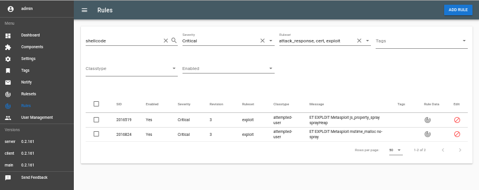

# Detector GUI user manual.

## 1. Overview

Detector’s GUI primary target is to provide a simple and intuitive way to provision Ruleset updates for Suricata and handle data exchange with Central system. Along the way it also provides means to seamlessly install essential extra tools to handle alarms locally, monitor system’s overall health and capture traffic if necessary.

## 2. Dashboard

* Registration Status: displays systems current state from Central system perspective.
* Last sync with Central: Registered system has online connection to the Central system to proactively retrieve Suricata rules provided and/or reviewed by CERT-EE.
* Rules: State of the received rules, unpublished rules
* Installed Components: 
* Component problems: System is constantly following the state of the components and this is the compact overview of those.

## 3. Rule manager

Provides intuitive way to manage rulesets or single rules to provide configuration to Suricata.

## 4. Components

Interface to manage and review component states and statuses. Possible actions include Install, uninstall, enable, disable, restart and recheck status.

* Auto upgrade: Debian’s "unattended-upgrades" functionality.
* Elasticsearch: Essential component, database for storing alerts coming from Suricata
* Evebox:GUI and parser to process alerts from Suricata and manage the alert flow.
* * Evebox-agent is part of evebox
* Moloch: Packet capturing, indexing and collecting system.
* Netdata: System metrics collecting and monitoring to provide accurate and live data about Detector Systems performance.
* Nginx: Web server
* NFSen: Lightweight packet capturing and graphing system.
* Suricata:Fast and robust network threat detection engine.
* Telegraf: System metrics collecting and transporting system to provide overview for CERT-EE
* OpenVPN: Provides private tunnel for CERT-EE to manage the system and assist local operator if necessary.

## 5. Settings

* Alerts: It is possible to manage time interval, how often data is pushed and verbosity and depth level of information which will be sent to CERT-EE.

* Rules: Simple setup to trigger automated update of rules as well as update pull frequency.

* Moloch Settings: Enable usage of Yara rules and Wise service with the possibility to define custom IP exclusion list.

* Network: Capturing interface(s) reconfiguration.

* General: Allow or disallow Status Report to CERT-EE Central control with push fequency support.

* SMTP server settings: Detector lacks mail relay service, instead full range of SMTP settings has been provided for external SMTP relay exploitation.

* Nginx TLS: Provides possibility to use custom Certificates instead of system default.

## 6. Tags

Tag management for tags used in Rule Manager.

## 7. Notify

Provides means to configure email notifications based on Suricata alerts. Settings include rule description, destination email address, subject and Elasticsearch query, which
makes it possible to define highly dynamical rules for alerting.

Notify mechanism supports two types of alerts:
* Simple alert - based on simple query result count, if > 0, alert is triggered, all found entries will be sent via email. If aggregation has been defined, aggregation alert will be preferred (see next item).

Example query:

    {
      "query": {
        "bool": {
          "must": [
            {
              "term": {
                "alert.severity": 1
              }
            }
          ]
        }
      }
    }

* Aggregation alert - checks for result buckets.length, if > 0, aggregation alert is triggered and message will be sent via email. 
  For optimal use it's suggested to define '"size": 0' in ES query, as results are irrelevant for aggregation alert.

Example query:

    {
      "size": 0,
      "query": {
        "bool": {
          "must": [
            {
              "range": {
                "timestamp": {
                  "gt": "now-60m"
                }
              }
            }
          ]
        }
      },
      "aggs": {
        "notify": {
          "date_histogram": {
            "field": "@timestamp",
            "interval": "30m"
          },
          "aggs": {
            "treshold": {
              "bucket_selector": {
                "buckets_path": {
                  "alarms_count": "_count"
                },
                "script": "params.alarms_count > 100"
              }
            }
          }
        }
      }
    }

## 8. User management

Provides means to manage users and view user action log.
User can have either admin or view only privilege, which translates to subcomponents as well.

## 9. Feedback

Send feedback or troubleing issues stright to the Central CORE. Specialists in CERT-EE will see them
through and provide help if possible.

