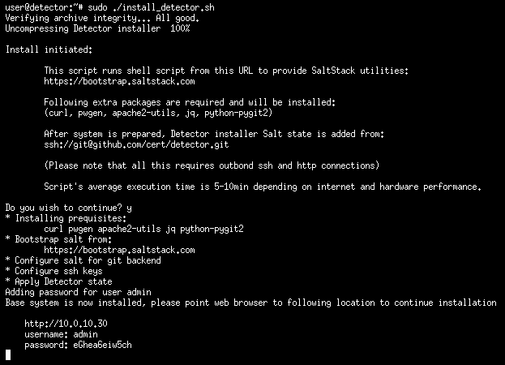
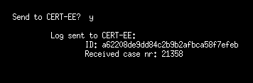
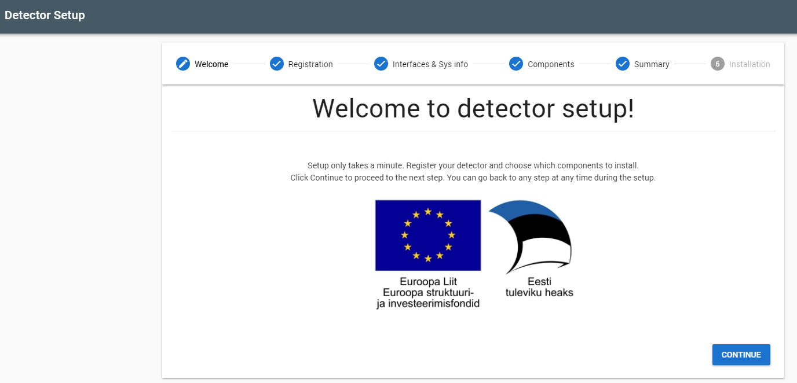
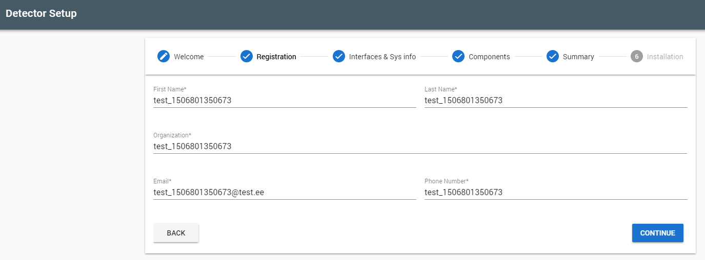
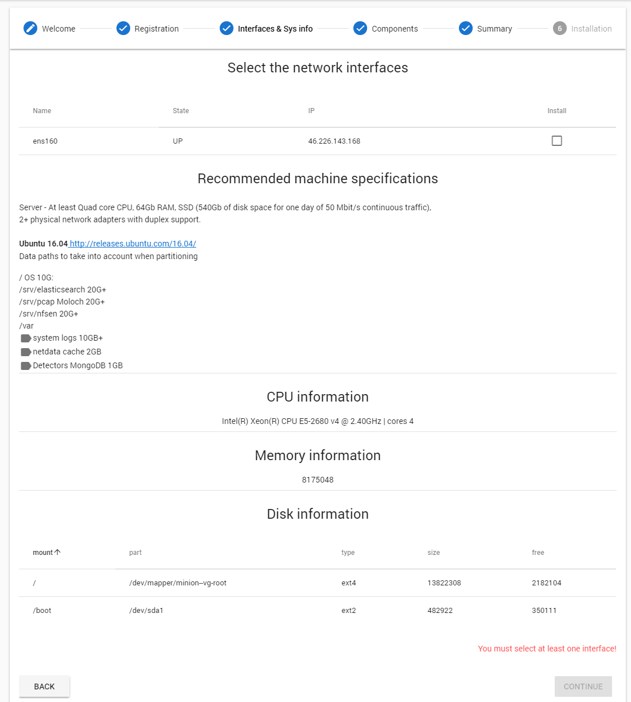
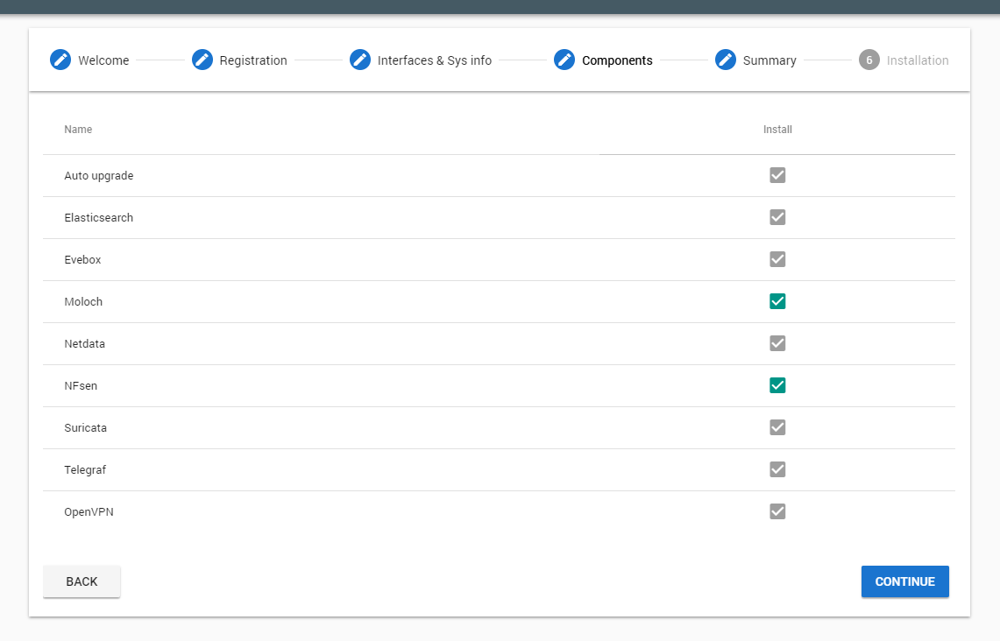
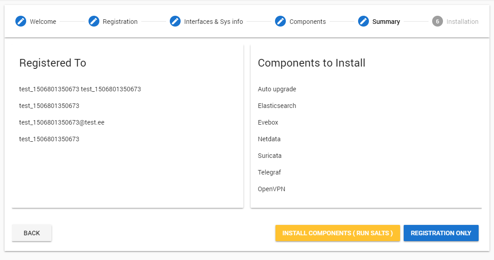
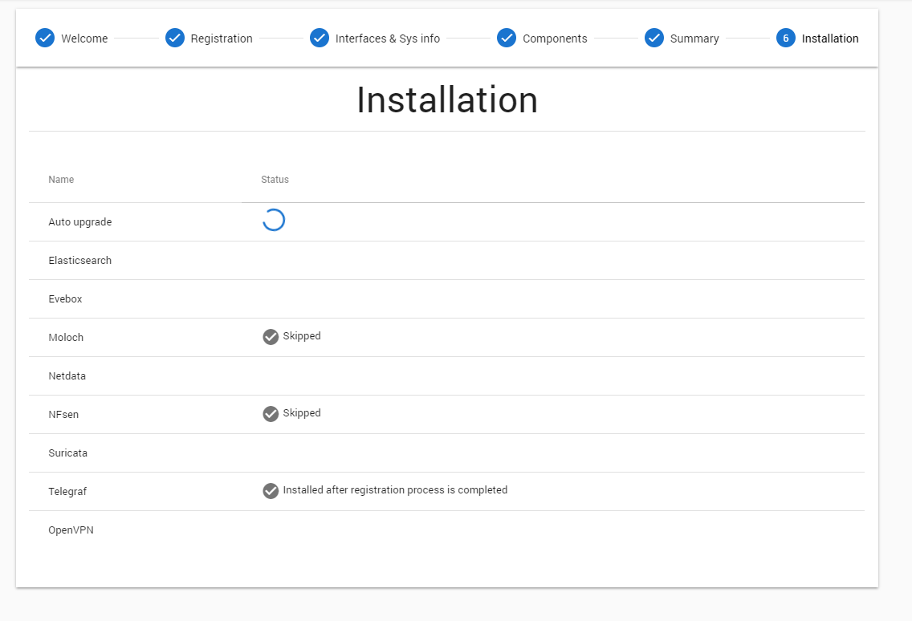

# Install Detector

## Prerequisites

### Hardware

* CPU - Quad Core Intel i7 CPU or better
* 64Gb RAM
* Solid State Drives (SSD)
* 2+ physical network adapters.

As it is unpredictable in which environment exactly the server will run (it's not only the bandwidth, that matters,
but type of traffic as well). This is a rough estimation, which should be more than sufficient in average environments.
The system requires components and is performing the function which requires utilization of all types of hardware.

### OS

* [Ubuntu 16.04](http://releases.ubuntu.com/16.04/)

### Networking

Configured Internet connection on one network. No specific rules for ingress traffic are needed.
Egress traffic wise, the detector needs access to the following locations:

* central.example.com tcp/5000 - Central side API endpoint
* tcp/80 and tcp/443 to anywhere - Github for salt states and various apt repositorys to install required packages

### Disk requirements

* **Suricata**
  * For Suricata this depends heavily both on traffic and system settings used - size of the PCAP embedded in event packet, but even
    in modest enviroments and small PCAP length this can be gigabytes in a day.
* **Moloch** / **NFSen**:
  * 1Gbps of network traffic requires ~300GB of disk a day. For example, to store 14 days of 2.5Gbps average traffic you need `14*2.5*300` or ~10TB of disk space.
  * Have at least 3% of disk space available in memory. For example, if the cluster has 7TB of data then `7*0.03` or 210GB of memory is the minimum recommended. Note: the more days stored the memory ratio can actually decrease, to 2% or 1%.
  * Assign half the memory to elasticsearch (but no more then 30G per node) and half the memory to disk cache.
* **Recording PCAP**
  * Example of rough calculation: Link that averages 50Mbps - = 6.25 MB/s = 375 MB/minute = 22,500 MB/hour = 540,000 MB/day.

* Data paths to take into account when partitioning
  * / - Ubuntu 16.04 - **10GB** (about)
  * /srv/elasticsearch
  * /srv/pcap
  * /srv/nfsen
  * /var
  * /log system logs      10GB (start from)
  * /netdata cache        2GB (approx)
  * Detectors MongoDB     1GB (approx)

## Installation process

1. Log in to the server via console or ssh

1. Download and run installation script

    **NB! The below is an example. Ask the person managing the Central you wish to connect to for the correct script.**

        ```bash
        wget https://github.com/cert-ee/s4a/raw/master/scripts/install_detector.sh https://github.com/cert-ee/s4a/raw/master/scripts/install_detector.sh.md5
        md5sum -c install_detector.sh.md5sum
        sudo bash ./install_detector.sh
        ```

1. Installation - console
    * Initial installer script checks for os distribution and version. Mismatch of either of those will not block the installation, but continuing is at the users "own responsibility".
    * Presence of dpkg utility is checked, which is mandatory - only debian packages are supported for now.
    * For early problem detection host and port checks for Deb and Git repos are done.
    * Prerequisite packages will be installed, to complete the installation
    * SaltStack will be installed using [https://bootstrap.saltstack.com](https://bootstrap.saltstack.com)
    * Detector and Nginx states will be applied via SaltStack from CERT-EE git repository.
    * User will be displayed the __web address__ where installation will continue along with __username__ and __password__.



## Problem handling

In case of issues user will see the log and will be provided a possibility to automatically send those to CERT-EE. This is done via standard API and as a result user will receive the registered issue number which user can be used as a referral.



## Installation - webinterface

* Registration: User is asked for general contact information, which is used for identifying and contacting the customer, if necessary.
* Interface selection: System needs at least two interfaces. One for management and the other one(s) for flow capture. It is important **not** to choose management interface at this point, but interface(s) suitable for flow capture as not following this might lock user out of the system.
* Components: Most of the components are listed for informational reasons and can’t be disabled as they are essential for system functions. User can choose between Moloch (professional tool) and NFSen (more lightweight) for flow capture.
* Summary: Before starting the installation, user will be presented with the final configuration.
* Installation: User can observe the installation process, user can see the standard output of the installed components and any errors should they occur
* Final: User will be redirected to the actual/main interface where the  full functionality is activated after Central has approved the registration application.

## Screenshots

### Step 1



### Step 2



### Step 3



### Step 4



### Step 5



### Step 6

