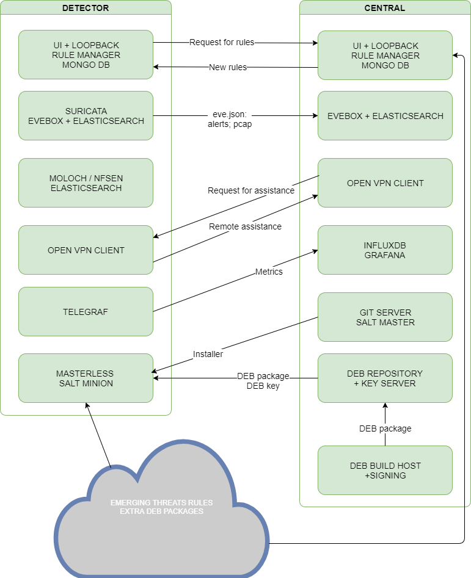
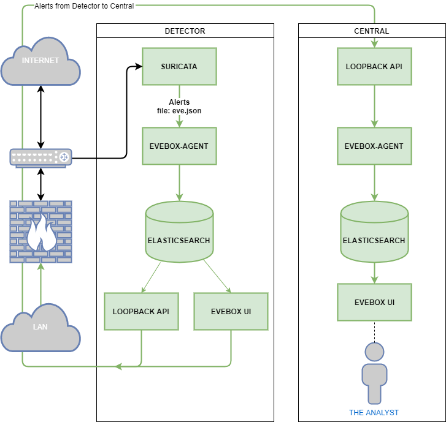
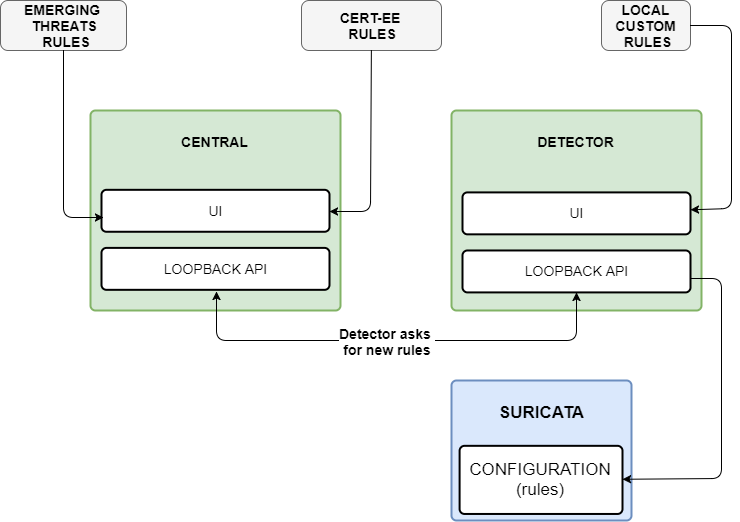

# System technical overview

## Introduction

S4A is based on open source components, all of which are chosen to work as an integrated unit based on experience and best practices. To make the installation procedure as simple and trouble free as possible, all components are packaged to Debian package format (deb). Package integrity is verified via signatures and provided key.

Detector’s installation and configuration is provisioned via SaltStack states in publicly available GIT repositories. This provides the possibility of easily deployable component upgrades and configuration changes and has no requirement for separately downloadable big installation or upgrade package. The initial install script itself is extremely lightweight. It downloads a reasonable amount of prerequisites to provide SaltStack minion functionality and some means of error reporting for support purposes.

All data which has to travel through internet between Central and Detector system is encrypted using standard TLS encryption.

Components integration is either done via standard way or as standard as possible with some support from custom made software based on NodeJS and Loopback. It’s goal is to keep the setup easily upgradable and as minimally dependant as possible on custom software.

## Data flow diagrams

* Systems integration

    

* Alerts flow diagram

    

* Rules flow diagram

    
