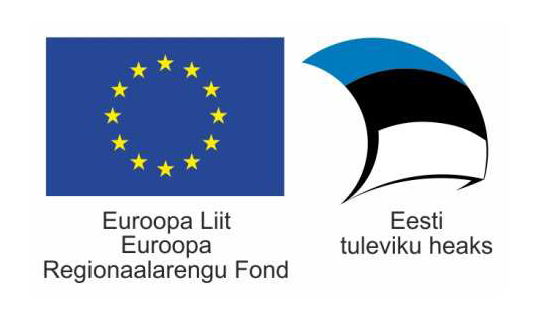

# What is Suricata for All

Project is funded by:

## Overview

Suricata for All (S4A) is a distributed intrusion detection system (IDS). It utilizes open source software components to monitor, analyse and capture network traffic to detect possible intrusions.

S4A has custom-built user interfaces for central administration console, simply named Central and custom-built user interface for local site administrators named Detector.

Open source software is hosted in public code repository 

* [http://github.com/cert-ee/s4a](http://github.com/cert-ee/s4a) - Salt states and pillars, build scripts, installer,

* [http://github.com/cert-ee/s4a-central](http://github.com/cert-ee/s4a-central)

* [http://github.com/cert-ee/s4a-detector](http://github.com/cert-ee/s4a-detector)

* [http://github.com/cert-ee/s4a-docs](http://github.com/cert-ee/s4a-docs)

The system is provisioned using SaltStack [https://saltstack.com/community](https://saltstack.com/community) via the Provided User Interface.

## Components:

* Suricata - Intrusion detection system.

    * [https://suricata-ids.org/](https://suricata-ids.org/)

    * Evebox - Web based alert and event management tool for events generated by the Suricata network threat detection engine [https://evebox.org](https://evebox.org)

* Netdata - a system for distributed real-time performance and health monitoring. In this project itis meant for independent health monitoring of detector installations.

    * [https://github.com/firehol/netdata](https://github.com/firehol/netdata)

* nfsen - NfSen is a graphical web based application for the nfdump netflow tool. Lightweight traffic analysis tool to substitute Moloch.

    * [http://nfsen.sourceforge.net/](http://nfsen.sourceforge.net/)

* Moloch - Moloch is an open source, large scale, full packet capturing, indexing and database system.

    * https://github.com/aol/moloch

* OpenVPN - Open Source VPN software.

    * [https://openvpn.net/](https://openvpn.net/)

* Elasticsearch - Elasticsearch is a Lucene based distributed full-text search and analytics engine designed for horizontal scalability, maximum reliability, and easy management. 

    * [https://www.elastic.co/products/elasticsearch](https://www.elastic.co/products/elasticsearch)

    * Telegraf - Telegraf is a metrics reporting agent written in Go for collecting, processing, aggregating and sending metrics to InfluxDB. [https://github.com/influxdata/telegraf](https://github.com/influxdata/telegraf)

* Detector & Central
    * Web interface to manage settings and other aspects: 
    * Communication with salt and web interface is done via loopback connected to a MongoDB database.
        * [https://github.com/strongloop/loopback](https://github.com/strongloop/loopback)
    * Frontend:
        * [https://github.com/nuxt/nuxt.js](https://github.com/nuxt/nuxt.js)
        * [https://github.com/vuetifyjs/vuetify](https://github.com/vuetifyjs/vuetify)