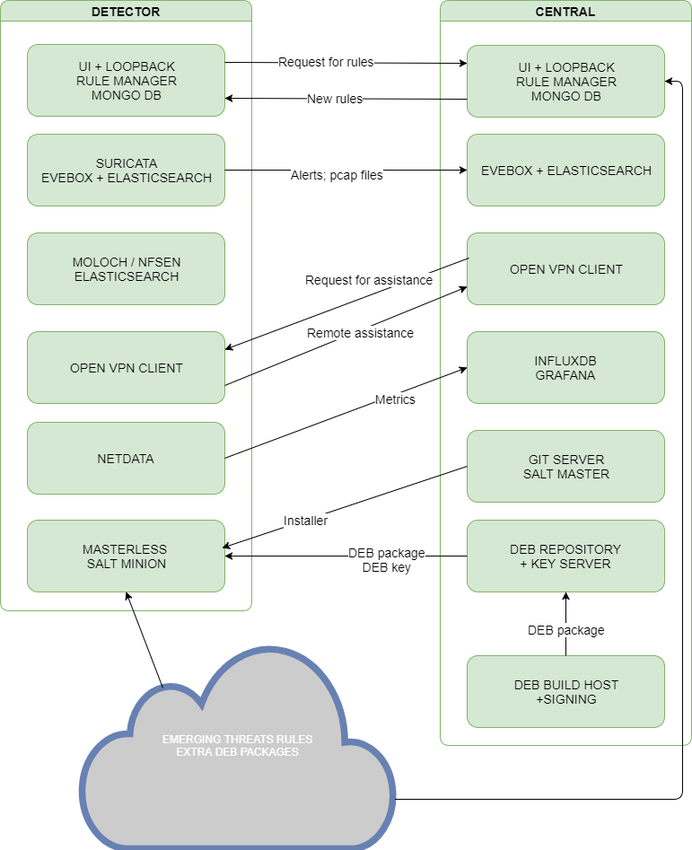

Government's network intrusion and malware detection system. 

The documentation

<table>
  <tr>
    <td>Verson</td>
    <td>Date</td>
    <td>Description</td>
  </tr>
  <tr>
    <td>v0.1</td>
    <td>August 2017</td>
    <td>First draft of documentation, general description</td>
  </tr>
  <tr>
    <td>v1.0</td>
    <td>30.09.2017</td>
    <td>Ready for handover</td>
  </tr>
  <tr>
    <td></td>
    <td></td>
    <td></td>
  </tr>
</table>

Project is funded by:

**Table of Contents**

[[TOC]]

# What is government's network intrusion and malware detection system? 

## Overview

Government's network intrusion and malware detection system is a distributed intrusion detection system (IDS). It utilizes open source software components to monitor, analyse and capture network traffic to detect possible intrusions. The system is distributed amongst the end user of the Data Communication in Public Administration network called ASO.

S4A has custom-built user interfaces for central administration console, simply named Central and custom-built user interface for local site administrators named Detector.

Open source software is hosted in public code repository 

* [http://github.com/razuz/s4a](http://github.com/razuz/s4a) - Salt states and pillars, build scripts, installer,

* [http://github.com/razuz/s4a-central](http://github.com/razuz/s4a-central)

* [http://github.com/razuz/s4a-detector](http://github.com/razuz/s4a-detector)

* [http://github.com/razuz/s4a-docs](http://github.com/razuz/s4a-docs)

The system is provisioned using SaltStack [https://saltstack.com/community](https://saltstack.com/community) via the Provided User Interface.

## Components:

* Suricata - Intrusion detection system.

    * https://suricata-ids.org/

    * Evebox - Web based alert and event management tool for events generated by the Suricata network threat detection engine https://evebox.org/

* Netdata - a system for distributed real-time performance and health monitoring. In this project itis meant for independent health monitoring of detector installations.

    * [https://github.com/firehol/netdata](https://github.com/firehol/netdata)

* nfsen - NfSen is a graphical web based application for the nfdump netflow tool. . Lightweight traffic analysis tool to substitute Moloch.

    * [http://nfsen.sourceforge.net/](http://nfsen.sourceforge.net/)

* Moloch - Moloch is an open source, large scale, full packet capturing, indexing and database system.

    * https://github.com/aol/moloch

* OpenVPN - Open Source VPN software.

    * [https://openvpn.net/](https://openvpn.net/)

* Elasticsearch - Elasticsearch is a Lucene based distributed full-text search and analytics engine designed for horizontal scalability, maximum reliability, and easy management. 

    * [https://www.elastic.co/products/elasticsearch](https://www.elastic.co/products/elasticsearch)

    * Telegraf - Telegraf is a metrics reporting agent written in Go for collecting, processing, aggregating and sending metrics to InfluxDB.[https://github.com/influxdata/telegraf](https://github.com/influxdata/telegraf)

* Detector - Web interface to manage detector settings and other aspects. Communication with salt and web interface is done via loopback connected to a MongoDB database.

    * https://github.com/strongloop/loopback

# Install Detector

## Prerequisites

* Server -  At least Quad core CPU, 64Gb RAM, SSD (540Gb of disk space for one day of 50Mbit/s continuous traffic), 2+ physical network adapters with duplex support.

* Ubuntu 16.04 http://releases.ubuntu.com/16.04/

* Configured Internet connection

* Data paths to take into account when partitioning

    * /			OS		10G:

    * /srv/elasticsearch 			20G+

    * /srv/pcap 		Moloch 	20G+

    * /srv/nfsen 				20G+

    * /var  

        * system logs			10GB+

        * netdata cache			  2GB

        * Detectors MongoDB		  1GB

## Installation process

1. Log in to the server via console or ssh

2. Download and run installation script

    * wget [https://github.com/s4a/install_detector.sh](https://github.com/s4a/install_detector.sh) [https://github.com/s4a/install_detector.sh](https://github.com/s4a/install_detector.sh).md5sum

    * md5sum -c install_detector.sh.md5sum

    * sudo bash ./install_detector.sh

3. Installation - console

    * Initial installer script checks for os distribution and version. Mismatch of either of those will not block the installation, but continuing is at the users "own responsibility". 

    * Presence of dpkg utility is checked, which is mandatory - only debian packages are supported for now.

    * For early problem detection host and port checks for Deb and Git repos are done.

    * Prerequisite packages will be installed, to complete the installation

    * SaltStack will be installed using [https://bootstrap.saltstack.com](https://bootstrap.saltstack.com)

    * Detector and Nginx states will be applied via SaltStack from CERT-EE git repository.

    * User will be displayed the **web address **where installation will continue along with **username** and **password**.

4. Screenshot

5. Problem handling

    * In case of issues user will see the log and will be provided a possibility to automatically send those to CERT-EE. This is done via standard API and as a result user will receive the registered issue number which user can be used as a referral.

	

6. Installation - webinterface

    * Registration: User is asked for general contact information, which is used for identifying and contacting the customer, if necessary.

    * Interface selection: System needs at least two interfaces. One for management and the other one(s) for flow capture. It is important **not** to choose management interface at this point, but interface(s) suitable for flow capture as not following this might lock user out of the system.

    * Components: Most of the components are listed for informational reasons and can’t be disabled as they are essential for system functions. User can choose between Moloch (professional tool) and NFSen (more lightweight) for flow capture.

    * Summary: Before starting the installation, user will be presented with the final configuration.

    * Installation: User can observe the installation process, user can see the standard output of the installed components and any errors should they occur

    * Final: User will be redirected to the actual/main interface where the  full functionality is activated after Central has approved the registration application.

## Screenshots

# Detector GUI user manual.

1. Overview

Detector’s GUI primary target is to provide a simple and intuitive way to provision Ruleset updates for Suricata and handle data exchange with Central system. Along the way it also provides means to seamlessly install essential extra tools to handle alarms locally, monitor system’s overall health and capture traffic if necessary.

2. Dashboard

    1. Registration Status: displays systems current state from Central system perspective.

    2. Last sync with Central: Registered system has online connection to the Central system to proactively retrieve Suricata rules provided and/or reviewed by CERT-EE.

    3. Rules: State of the received rules - new/count/enabled? [FIXME]+1

    4. Installed Components: 

    5. Component problems: System is constantly following the state of the components and this is the compact overview of those.

3. Rule manager

Provides intuitive way to manage rulesets or single rules to provide configuration to Suricata.

4. Components

Interface to manage and review component states and statuses. Possible actions include Install, uninstall, enable, disable, restart.

    6. Auto upgrade: Debian’s "unattended-upgrades" functionality.

    7. Elasticsearch: Essential component, database for storing alerts coming from Suricata

    8.  Evebox:GUI and parser to process alerts from Suricata and manage the alert flow.

    9. Moloch: Packet capturing, indexing and collecting system.

    10. Netdata: System metrics collecting and monitoring to provide accurate and live data about Detector Systems performance.  

    11. NFSen: Lightweight packet capturing and graphing system.

    12. Suricata:Fast and robust network threat detection engine.

    13. Telegraf: System metrics collecting and transporting system to provide overview for CERT-EE

    14. OpenVPN: Provides private tunnel for CERT-EE to manage the system and assist local operator if necessary.

5. Settings 

    15. Alerts: It is possible to manage the verbosity and depth level of information which will be sent to CERT-EE

    16. Rules: Simple setup to trigger automated update of rules.

    17. Network: Capturing interface(s) reconfiguration.

# Central System Installation Manual

## Prerequisites

* Ubunutu 16.04

* Working salt master server

## Optional

* Configured salt-cloud on master to provision servers for central components

## Used software

* SaltStack

* NodeJS >= v8

* Yarn

* Pm2 - Advanced Node.js process manager.

* MongoDB 3.4 ?

* Evebox

* Elasticsearch

* OpenVPN (Server) / OpenSSL

* Grafana/InfluxDB

* Nginx for serving DEB repository and GUI components

## Installation

You have to have Ubuntu 16.04 installed, next step is to install and configure SaltStack minion server. 

### On the Salt master

1. Ensure pillars and states for Elasticsearch, OpenVPN, Central, InfluxDB, Grafana, Nginx, MongoDB and Evebox are present and configured.

2. Add to pillar/top.sls:
‘Central.s4a.cert.ee’: - central \n - vpn \n - beacons

	‘influx.s4a.cert.ee’: - influxdb

	‘Vpn.s4a.cert.ee’: - vpn
	‘Keys.s4a.cert.ee’: - sks

3. Add to salt/top.sls:
‘Central.s4a.cert.ee’: - central \n - vpn.easy-rsa.config \n - s4a.beacon
‘Vpn.s4a.cert.ee’: - vpn
‘Influx.s4a.cert.ee’: - influx
‘Es.s4a.cert.ee’: - elasticsearch.single
‘Keys.s4a.cert.ee’: - sks.config
‘Repo.s4a.cert.ee’: - s4a.repo

4. Highstate all of the machines defined in 

1. First update repository listing 

    * sudo apt-get update

2. Install Salt-minion

    * sudo apt-get install salt-minion

3. Add salt-master address to host file

    * vi /etc/hosts or nano /etc/hosts

    * Master xxx.xxx.xxx.xxx

4. Start salt-minion  

    * service salt-minion stop

5. Apply Salt state for Central

Once salt-minion is installed, rest of the software will be installed according to presets and user preferences. All processes are provisioned via Salt states.

# System technical overview

## Introduction

System is based on open source components all of which are chosen to work as integrated unity based on experience and best practices. To make the installation procedure as simple and trouble free as possible, all components are packaged to Debian package format (deb). Package integrity is verified via signatures and provided key. 

Detector’s installation and configuration is provisioned via SaltStack states in publicly available GIT repositories. This provides the possibility of easily deployable component upgrades and configuration changes and has no requirement for separately downloadable big installation or upgrade package. The initial install script itself is extremely lightweight. It downloads a reasonable amount of prerequisites to provide SaltStack minion functionality and some means of error reporting for support purposes.

All data which has to travel through internet between Central and Detector system is encrypted using standard TLS encryption.

Components integration is either done via standard way or as standard as possible with some support from custom made software based on NodeJS and Loopback. It’s goal is to keep the setup easily upgradable and as minimally dependant as possible on custom software.

## Data flow diagrams

* Systems integration

* Detector -> Central Alerts

* Central -> Detector Rules

* Detector <-> Central VPN Certificate Signing and API key request

Detector easy-rsa key->csr -> Detector -> Central API -> Approval interface -> triggered Salt signing mechanism -> Detector API -> openvpn configuration.

[WILD SCREENSHOT EXPLOSION][FIXME]

## API Documentation

* Loopback

[FIXME]

